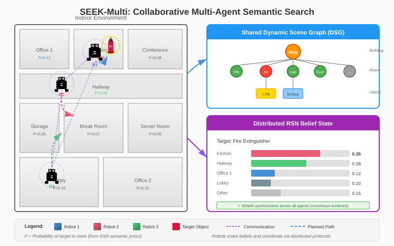

# 🤖 SEEK-Multi: Collaborative Multi-Agent Semantic Reasoning

> **Enabling teams of robots to collaboratively search for and inspect target objects through distributed semantic reasoning, belief fusion, and coordinated task allocation.**

[](docs/static/pdfs/seek-multi.pdf)
[](LICENSE)
[](https://www.python.org/downloads/)

---

## 📋 Overview

**SEEK-Multi** extends the single-agent SEEK framework to enable **multi-robot teams** to collaboratively search for and inspect target objects in complex environments. The system integrates:

| Feature | Description |
|---------|-------------|
| **Semantic Reasoning** | Leverages object-room relationships for intelligent search prioritization |
| **Distributed Belief Fusion** | Consensus-based protocols for belief convergence across agents |
| **Shared Scene Graphs** | Dynamic hierarchical environment representations with efficient updates |
| **Task Allocation** | Auction-based mechanisms for conflict-free task assignment |
| **Communication** | Priority-based message protocols with adaptive bandwidth management |
| **Robustness** | Graceful degradation under communication failures and agent heterogeneity |

##  System Architecture


The system consists of distributed components across multiple agents, each maintaining:
- Local Dynamic Scene Graph (DSG)
- RSN belief module for probabilistic reasoning
- Task allocator for resource management
- Communication module for inter-agent coordination
- Belief fusion component for consensus

---

## 📦 Installation

```bash
# Clone and navigate to project
git clone https://github.com/arrdel/seek-multi.git
cd seek-multi/seek_multi

# Install dependencies
pip install -r requirements.txt
```

**Requirements:**
- Python 3.8+
- PyTorch 1.9+
- NumPy, SciPy
- (Optional) GPU for faster simulation

## 📁 Project Structure

```
seek_multi/
├── src/
│   ├── __init__.py              # Package initialization
│   ├── agent.py                 # Individual inspection agent
│   ├── coordinator.py           # Multi-agent coordinator
│   ├── communication.py         # Communication protocols
│   ├── shared_dsg.py           # Shared Dynamic Scene Graph
│   ├── distributed_rsn.py      # Distributed Relational Semantic Network
│   ├── collaborative_planner.py # Collaborative planning algorithms
│   ├── task_allocator.py       # Task allocation strategies
│   └── simulation.py           # Simulation environment
├── examples/
│   └── multi_agent_example.py  # Usage examples
├── tests/
│   └── test_multi_agent.py     # Unit tests
└── requirements.txt
```

## 🚀 Quick Start

```python
from seek_multi.src import (
    InspectionAgent,
    MultiAgentCoordinator,
    SharedDynamicSceneGraph,
    DistributedRSN
)

# Create shared environment representation
dsg = SharedDynamicSceneGraph.from_blueprint(
    agent_id="main",
    rooms=rooms,
    connections=connections
)

# Create shared semantic network
rsn = DistributedRSN(agent_id="main")
rsn.register_rooms([(r["id"], r["name"]) for r in rooms])
# Create coordinator
coordinator = MultiAgentCoordinator()

# Create and register agents
for i in range(num_agents):
    agent = InspectionAgent(
        agent_id=f"robot_{i}",
        dsg=dsg,
        rsn=rsn
    )
    coordinator.register_agent(agent)

# Start mission
mission = coordinator.start_mission(
    target_object="fire_extinguisher",
    initial_positions=positions
)
```

## 🔧 Core Components

### 1. Shared Dynamic Scene Graph

Hierarchical environment representation that supports distributed updates and merging.

```python
# Create from blueprint
dsg = SharedDynamicSceneGraph.from_blueprint(
    agent_id="main",
    rooms=rooms,
    connections=connections
)

# Merge updates from another agent
dsg.merge(other_dsg)
# Query graph
rooms = dsg.get_room_nodes()
distance = dsg.get_distance("room_1", "room_2")
```

### 2. DistributedRSN

Distributed Relational Semantic Network for belief maintenance and fusion.

```python
# Initialize belief
rsn.initialize_belief("fire_extinguisher")

# Update from observation
rsn.update_belief_from_observation(
    object_class="fire_extinguisher",
    room_id="kitchen",
    detected=False,
    thorough_search=True
)

# Fuse belief from another agent
rsn.fuse_belief_from_agent(
    object_class="fire_extinguisher",
    other_belief=other_agent_belief,
    other_confidence=0.8,
    other_agent_id="agent_2"
)
```

### 3. CollaborativePlanner

Coordinates planning across multiple agents.

```python
planner = CollaborativePlanner(agent_ids=["agent_1", "agent_2"])

plan = planner.compute_coordinated_plan(
    target_object="fire_extinguisher",
    room_probabilities=belief.room_probabilities,
    dsg=dsg,
    agent_positions=positions
)

# Get action for specific agent
action = planner.get_agent_action("agent_1")
```

### 4. TaskAllocator

Distributes inspection tasks among agents using various strategies.

```python
allocator = TaskAllocator(
    agents=agent_capabilities,
    method=AllocationMethod.AUCTION
)

allocation = allocator.allocate(dsg, room_probabilities)
```

## Communication Protocol

Agents communicate through a message-passing system:

```python
# Send belief update
comm.broadcast_belief_update(BeliefUpdate(
    room_id="kitchen",
    object_class="fire_extinguisher",
    probability=0.8,
    confidence=0.9
))

# Send object detection
comm.broadcast_object_detection(
    object_class="fire_extinguisher",
    position=position,
    confidence=0.95,
    room_id="kitchen"
)

# Declare intention
comm.send_intention(
    target_room="kitchen",
    action_type="search_room",
    estimated_duration=30.0
)
```

## Running Simulations

```python
from seek_multi.src.simulation import run_simulation

# Run with 3 agents
results = run_simulation(
    num_agents=3,
    target_object="fire_extinguisher",
    max_steps=500,
    verbose=True
)

print(f"SPL: {results['spl']}")
print(f"Steps: {results['steps']}")
print(f"Rooms searched: {results['rooms_searched']}")
```

## 📊 Performance Results

### Multi-Agent Scaling Performance

| Configuration | Success Rate | Speedup | Team SPL | Comm. Messages |
|:---|---:|---:|---:|---:|
| **Single Agent (Baseline)** | 94.2% | 1.00× | 0.84 | — |
| **2 Agents** | 95.8% | 1.87× | 0.81 | 124 |
| **3 Agents** | 96.4% | 2.59× | 0.78 | 218 |
| **4 Agents** | 96.9% | 3.10× | 0.75 | 342 |
| **5 Agents** | 97.1% | 3.53× | 0.71 | 456 |
| **6 Agents** | 97.3% | 3.85× | 0.68 | 589 |

**Key Findings:**
- ⚡ **Near-linear speedup** for up to 4 agents
- 🎯 **97%+ success rate** maintained across all configurations  
- 📈 **Graceful diminishing returns** as team size increases

### Comparison with Baseline Methods

| Method | Success Rate | SPL | Time (s) | Coordination Type |
|:---|---:|---:|---:|:---|
| **SEEK-Multi (Ours)** | **96.9%** | **0.75** | **45.2** | Semantic + Auction |
| Frontier-Based Multi-Robot | 89.3% | 0.58 | 72.8 | Geometric |
| Random Allocation | 78.4% | 0.42 | 98.3 | None |
| Greedy Distance | 85.1% | 0.51 | 81.5 | Local |
| MCTS Coordination | 92.7% | 0.68 | 56.4 | Centralized |

**Performance Metrics:**
- 📊 **SPL (Success weighted by Path Length)**: Efficiency of completed tasks
- 🎯 **Success Rate**: Percentage of missions that found the target
- ⏱️ **Time**: Average completion time in simulation seconds

---
<!-- 
## 📖 Citation

If you use SEEK-Multi in your research, please cite our work:

```bibtex
@article{seek-multi2024,
  title={SEEK-Multi: Collaborative Multi-Agent Semantic Reasoning for Object Goal Navigation in Inspection Tasks},
  author={Chinda, Adele},
  journal={arXiv preprint arXiv:2024.xxxxx},
  year={2024}
}
``` -->

**📄 [Read the Full Paper](docs/static/pdfs/seek-multi.pdf)**

---

## 🤝 Contributing

Contributions are welcome! Please feel free to submit pull requests or open issues for bugs and feature requests.

## 📝 License

This project is licensed under the MIT License - see the [LICENSE](LICENSE) file for details.

## 🙏 Acknowledgments

- Built upon the SEEK framework for single-agent semantic reasoning
- Inspired by consensus protocols and multi-robot coordination literature
- Thanks to the robotics and AI community for invaluable feedback
